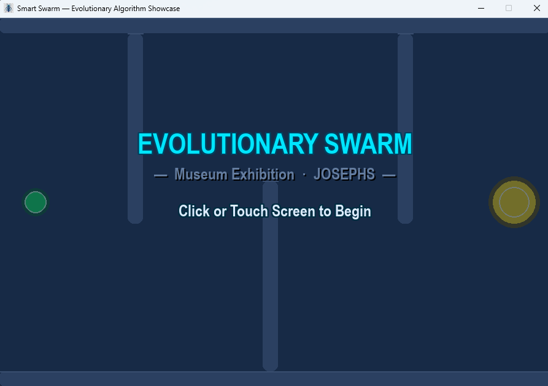
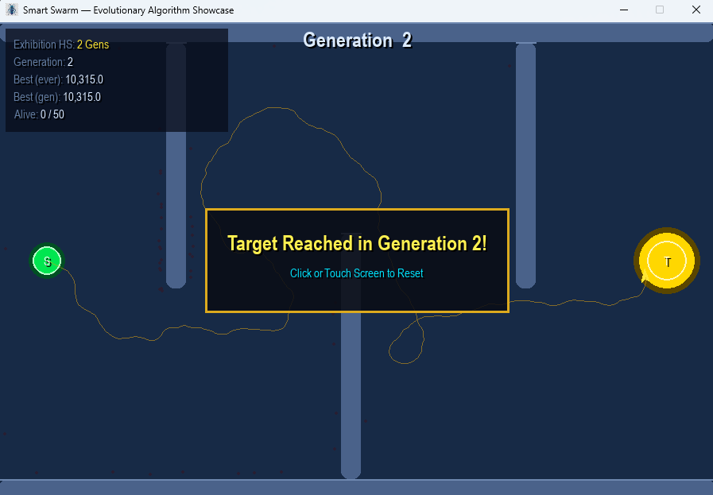

# Smart Swarm — Evolutionary Algorithm Showcase





> Add your screenshots to `assets/screenshots/` using the filenames above.

---

## Project Overview

**Smart Swarm** is a real-time simulation of a Genetic Algorithm (GA) learning to navigate a
slalom maze. A population of 50 virtual ants evolves over successive generations, each inheriting
a genome of movement instructions. Through selection pressure, crossover, and mutation, the
population converges on an agent capable of navigating the full obstacle course — making the
invisible mathematics of evolutionary biology visible in real time.

The project was built as a scientific exhibit for the **JOSEPHS® — Werkstatt für Innovation**
museum in Nuremberg and is deployable both as a native desktop application and as a
browser-based WebAssembly experience.

---

## Key Features

- **5-State Exhibition Loop** — A clean `AppState` enum drives the full visitor experience:
  `START_SCREEN → SIMULATING → EVALUATING → SUCCESS → RESET_LOOP`, with click/touch input
  and a persistent highscore that survives between resets.
- **Custom Pure-Python Genetic Algorithm** — Rank-based parent selection, single-point
  crossover, elitism (top 2 carried unchanged), and configurable per-gene mutation — zero
  third-party GA dependencies, fully compatible with WebAssembly (Pyodide).
- **Multi-Component Fitness Landscape** — Four orthogonal signals prevent looping exploits:
  a one-way x-progress ratchet (0–600 pts), discrete wall-clearing score cliffs (+75/150/300),
  a quadratic Euclidean proximity bonus (0–400 pts), and a minimal longevity term (0–40 pts).
- **Stagnation Detection & Diversity Injection** — If the generation best does not improve by
  more than 5 pts over 8 consecutive generations, the bottom 30 % of the population is replaced
  with fresh random genomes, breaking local optima automatically.
- **Sci-Fi HUD Rendering** — SRCALPHA semi-transparent trail compositing, arrowhead polygon
  agents oriented via `math.atan2`, pulsing target zone, neon-glow text, and drop-shadow
  typography — all drawn directly in Pygame with no external rendering library.
- **Browser Deployment via WebAssembly** — `SBS/run_web.py` pre-caches BrowserFS, launches
  Pygbag as a managed subprocess, and runs a background favicon guard so the exhibit icon
  survives Pygbag's build cycle.
- **Exhibition Highscore** — Tracks the fewest generations ever needed to solve the maze within
  a session, displayed in gold on the start screen and HUD.

---

## Tech Stack

| Layer | Technology |
|---|---|
| Language | Python 3.11+ |
| Simulation & Rendering | [Pygame](https://www.pygame.org/) ≥ 2.5 |
| Browser / WebAssembly | [Pygbag](https://pygame-web.github.io/) ≥ 0.9 |
| Async Runtime | `asyncio` (standard library — required by Pygbag) |
| Genetic Algorithm | Custom pure-Python implementation (`random`, `math`) |
| Package Structure | `SBS/` namespace package (`config`, `agent`, `environment`, `simulation`, `run_web`) |

---

## Project Structure

```
EvolutionaryAlgorithm/
├── main.py               # Entry point (desktop + browser)
├── assets/
│   ├── icon.png          # Application icon (desktop taskbar / Dock)
│   └── favicon.png       # Browser tab icon (served by Pygbag)
├── pygbag.ini            # Pygbag packaging config (exclude .venv, build, etc.)
├── requirements.txt
└── SBS/
    ├── __init__.py
    ├── config.py         # All tunable constants (EA params, colours, maze layout)
    ├── agent.py          # BaseAgent + Ant (genome decoding, fitness, rendering)
    ├── environment.py    # Walls, zones, collision detection
    ├── simulation.py     # SimulationEngine + _GeneticAlgorithm + AppState machine
    └── run_web.py        # Browser launcher (BrowserFS cache + favicon guard)
```

---

## Installation & Execution

### Prerequisites

- Python 3.11 or later
- `git`

### 1 — Clone the repository

```bash
git clone https://github.com/<your-username>/EvolutionaryAlgorithm.git
cd EvolutionaryAlgorithm
```

### 2 — Create and activate a virtual environment

```bash
python -m venv .venv

# macOS / Linux
source .venv/bin/activate

# Windows
.venv\Scripts\activate
```

### 3 — Install dependencies

```bash
pip install -r requirements.txt
```

### 4 — Run (Desktop)

```bash
python main.py
```

Press **Escape** or close the window to quit.

### 5 — Run (Browser / WebAssembly)

```bash
python SBS/run_web.py
```

Then open **http://localhost:8000** in your browser.
On first launch the script downloads BrowserFS (~200 KB) and caches it locally —
subsequent launches are instant.

---

## Controls

| Input | Action |
|---|---|
| Click / Touch | Start a new run (on title screen) · Reset after a win |
| Escape | Quit the simulation |

---

## How It Works

```
Generation N starts
  └─ 50 ants spawn at START, each carrying a genome of 800 genes ∈ [-1, 1]
       └─ Each tick: gene → heading delta → new position → collision check
            └─ Ant dies on wall/boundary hit · stops on target entry
  └─ Generation ends when all ants are done
       └─ Fitness evaluated for each ant (4-component formula)
            └─ Top 15 parents selected by rank
                 └─ Elitism: top 2 copied unchanged
                 └─ Crossover + Mutation → 48 offspring
  └─ Generation N+1 starts with evolved population
```

---

## Development Process

This scientific showcase was architected and developed for the **JOSEPHS Exhibition**. The
underlying simulation logic, genetic algorithm tuning, and UI rendering were co-developed with
Artificial Intelligence (Claude 3.5 Sonnet / Gemini) to demonstrate modern AI-assisted
software engineering workflows.

---

## License

This project is shared for portfolio and educational purposes.